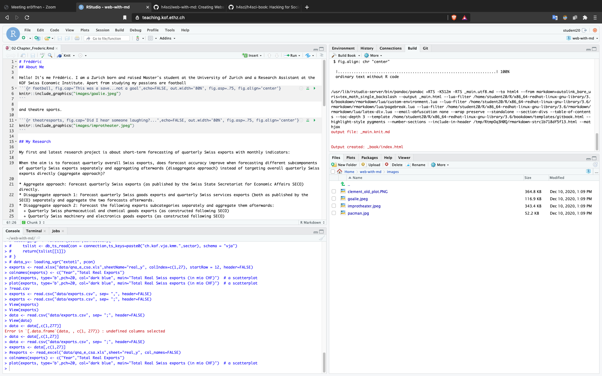

# Introduction

We construct a small example of a book with the package bookdown in Rmarkdown. 
This project is one of the possible projects for the course Hacking for Social Sciences (and the Humanities) by Matt Bannert.
You can find the other projects of the class at this [link](https://github.com/h4sci). 

This is how it looks behind the scenes:

