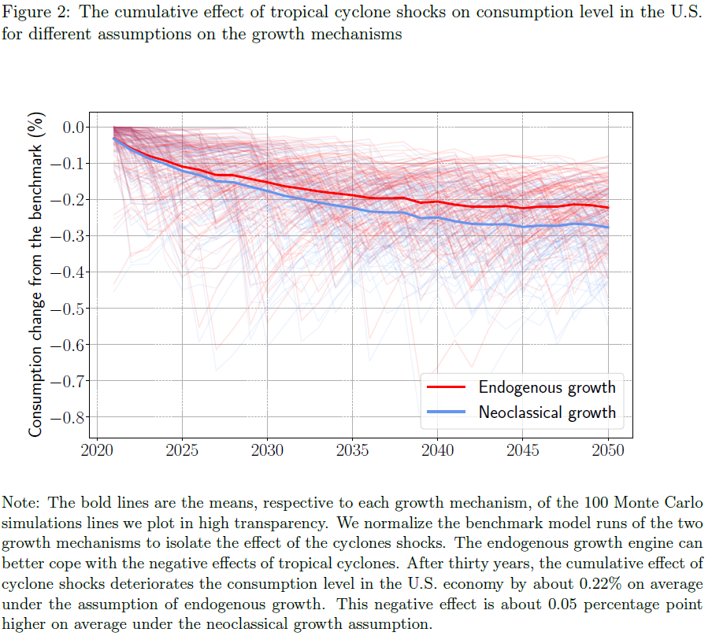

# Clément

## About Me
Hello, I am Clément, Doctoral researcher and Scientific Assistant at the Center of Economic Research (CER), ETH, since September 2018. 

## My Research

Part of my research focuses on the impact of tropical cyclones on the economy. We try to integrate advances from climate studies into the economic growth theory. Figure 1 is an old screenshot of my research. (I do not want to spoil too much of the final results!)

 Figure 1: Screenshot of my research 

I also work on the implementation of interlinked (climate) shocks in economic models and mitigation policies. Finally, I also do work on economic inequalities related to carbon taxation.